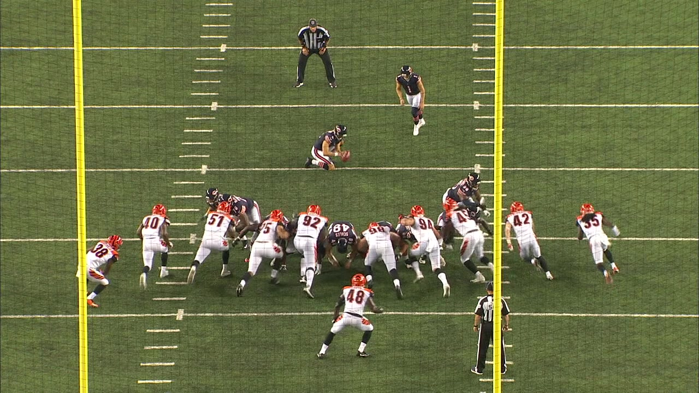

# NFL Challenge: Detect helmets in American Football

This projects contains a pretrained EfficientDet that detects helmets in football images.



## Models
EfficientDet from ... repo.

## Dataset
The data were provided by th challenge orginisers. The data can be downloaded from the [NFL Impact Detection](https://www.kaggle.com/c/nfl-impact-detection). The script to download the dataset is in ```scripts/download_data```. 

To generate the frames in the right place and format, you can run `python preprocess_data.py`, that will take the raw videos from the `data/train` folder and create images. Feep in mind, it requires disk space of 65 GB for the full dataset. 

## Prepare environment 
1. Clone this repo
2. Install anaconda
3. Run ```scripts/create_env.sh``` bash file to set up the conda environment
4. Run ```pip install -r requirements.txt```

## Make folds
python -m src.folds.make_folds


## Inference

For images run:
```python predict_image.py -i some.jpg -o some_output.jpg```

For MP4 videos, you have to go through every frame and run the prediction.
```python3 predict_video.py -i some.mp4 -o some_output.mp4```

## Reproduce the Training

Given you have the training data in place already, run:

```python train_helmet_detector.py```

It will generate the training/test set first from the images.
As the training executes, you will be able to see it using neptune 

All model configurations are default and relevant hyperparameters are in the code.

## Test the train runners
python -m src.pretrain_runner --model-name "unet_se_resnext101_32x4d" --encoder "se_resnext101_32x4d" --debug True --image-size 224 --epochs 2 --lr 1e-3 --batch-size 16 --num-workers 2

python -m src.train_runner --model-name "unet_se_resnext101_32x4d" --encoder "se_resnext101_32x4d" --debug True --image-size 224 --epochs 2 --lr 1e-3 --batch-size 16 --num-workers 2 
