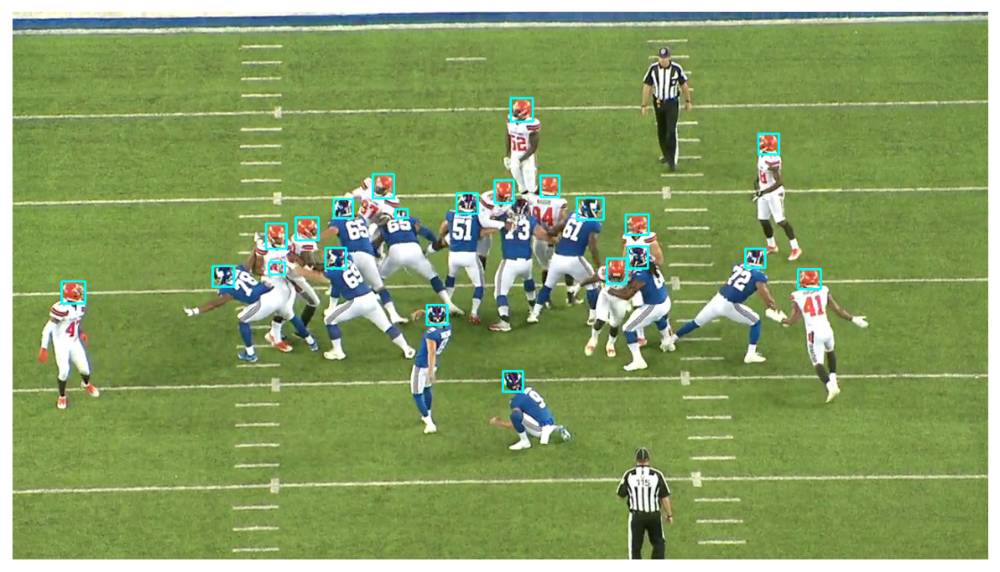

# NFL Challenge: Detect helmets in American Football

This projects contains a pretrained EfficientDet that detects helmets in football images.



## Models
EfficientDet from PyTorch [repo](https://github.com/google/automl/tree/master/efficientdet).

1D CNN classifiers

## Dataset
The data were provided by th challenge orginisers. The data can be downloaded from the [NFL Impact Detection](https://www.kaggle.com/c/nfl-impact-detection). The script to download the dataset is in ```scripts/download_data```. 

To generate the frames in the right place and format, you can run `python src.prepare_data.py`, that will take the raw videos from the `../../data/train` folder and create images. Feep in mind, it requires disk space of 65 GB for the full dataset. 

## Prepare environment 
1. Clone this repo
2. Install anaconda
3. Create conda environment
4. Run ```pip install -r requirements.txt```

## Make folds
All folds are in ```src/folds``` directory, make_folds.py creates folds

## Inference
For MP4 videos, you have to go through every frame and run the prediction.
Use  `src/prepare_data.py` to generate frames from videos.

For images, run:
```python inference.py``` runs inference for helmets detection

## Reproduce Training

Generate training frames. 

Change path to data in ```src.effdet_train.py```

First, train 1-class helmet detection:
```python src.effdet_train.py```

Change path to wieghts in ```src.effdet_train_2classes.py```

Fine-tune detection for 2 classes: ```python src.effdet_train_2classes.py```
